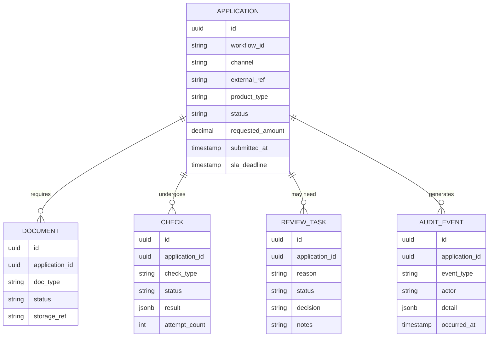
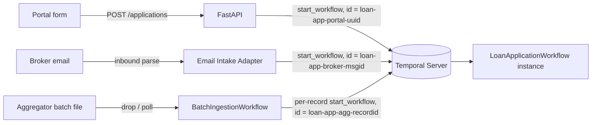
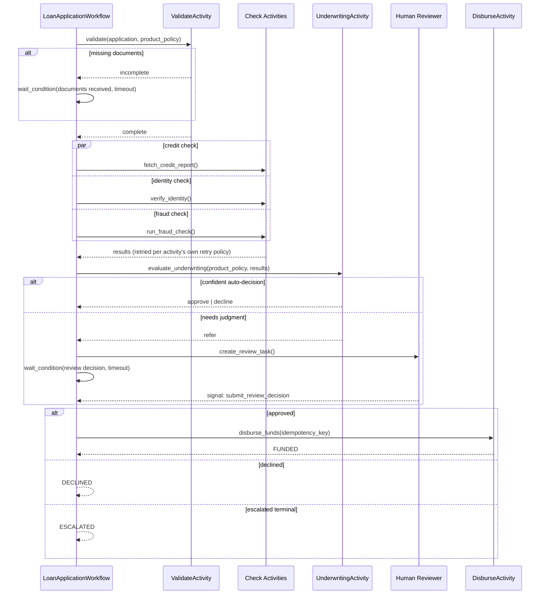
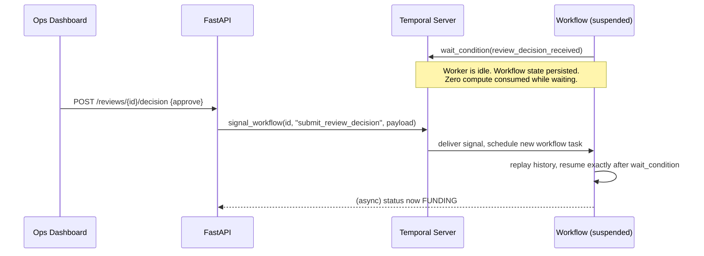
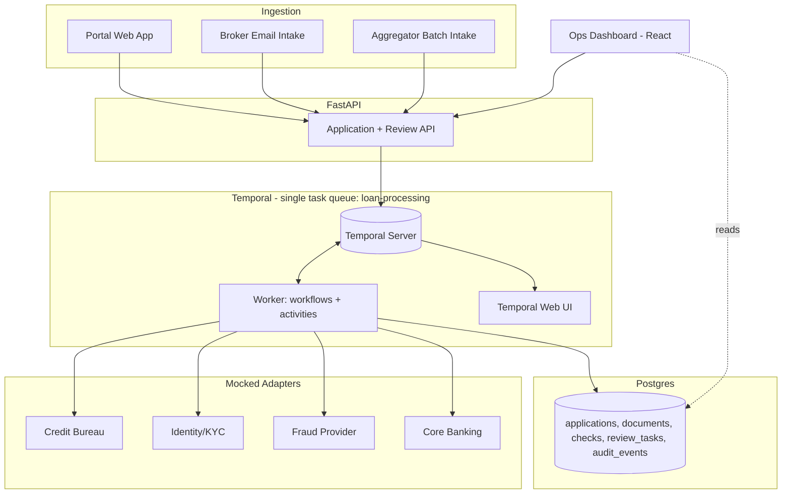

# System Design — Loan Disbursement Orchestration

This doc follows a six-step system design framework. It describes the design as
actually built. Where a more sophisticated version exists and was deliberately
left out to keep this buildable, that's called out inline and covered in full in
[05 — Trade-offs & Future Work](./05-tradeoffs-and-future-work.md) — that doc is
the "if I had another week" version of this one.

1. [Requirements](#1-requirements)
2. [Core Entities](#2-core-entities)
3. [APIs / System Interfaces](#3-apis--system-interfaces)
4. [Data Flows](#4-data-flows)
5. [High-Level Design / Architecture](#5-high-level-design--architecture)
6. [Deep Dives](#6-deep-dives)

---

## 1. Requirements

Full detail in the [PRD](./01-PRD.md) (§5–6). The short version, as design drivers:

| Driver | Design implication |
|---|---|
| 3 heterogeneous intake channels | One canonical application model behind channel-specific adapters |
| 48h SLA | Track a deadline per application; surface it, don't just store it |
| Third-party rate limits / partial failures / outages | Bounded automatic retry per activity, explicit escalation when it's exhausted |
| Multiple products, distinct rules | Product logic isolated behind a small policy interface; one workflow definition |
| Regulatory audit | Every decision reconstructable — who/what, when, why |
| Human review, clean resume | Durable pause/resume without polling or held threads |

**Why Temporal fits this problem:** almost every driver above is a durable-
execution problem — state that must survive process restarts and days-long waits
for a human, with retry and a replayable history built in. That's what Temporal
gives you for free; the alternative is hand-rolling a chunk of it on top of a
database and a queue.

---

## 2. Core Entities

Five tables. `CHECK` is generic across credit/identity/fraud rather than three
separate tables — same shape, different `check_type`. Underwriting decisions
aren't a separate table; a decision (automated or human) is just an
`AUDIT_EVENT` with `event_type = "underwriting_decision"` and the rule trace/risk
score in `detail`. A loan product's policy isn't a database row at all — it's a
small class in code (`backend/policies/`), looked up by `product_type`; see §6.

---

## 3. APIs / System Interfaces

### 3.1 External-facing (FastAPI)

| Method | Path | Purpose |
|---|---|---|
| `POST` | `/applications` | Portal submission → starts a workflow |
| `GET` | `/applications` | List/filter for the dashboard (status, product, SLA risk) |
| `GET` | `/applications/{id}` | Full detail — status, checks, documents, history |
| `POST` | `/applications/{id}/documents` | Upload a missing document → signals the workflow |
| `POST` | `/ingest/broker-email` | Webhook from the email intake step |
| `POST` | `/ingest/batch` | Aggregator batch drop |
| `GET` | `/reviews` | Review queue (applications currently needing a human) |
| `POST` | `/reviews/{id}/decision` | Approve / decline / escalate → signals the workflow |
| `GET` | `/audit/{application_id}` | Full audit trail |

### 3.2 Internal — Temporal Signals & Queries

| Kind | Name | Purpose |
|---|---|---|
| Signal | `submit_document(doc)` | Applicant uploaded a missing document |
| Signal | `submit_review_decision(decision)` | Human reviewer's approve/decline/escalate |
| Query | `get_status()` | Current state-machine status |
| Query | `get_sla_remaining()` | Time left against the 48h deadline |

Signals, not a synchronous `Update`, for the review decision — the dashboard
needs an immediate ack that the decision was recorded, not a blocking wait for
the workflow to finish processing it.

### 3.3 Third-party interfaces (mocked, stable contracts)

| Provider | Interface |
|---|---|
| Credit bureau | `POST /credit-check` → score, tradelines summary |
| Identity/KYC | `POST /identity-verify` → match/no-match, confidence |
| Fraud | `POST /fraud-check` → risk flags |
| Core banking | `POST /disburse` (idempotency-keyed) → transfer confirmation |

All four are mocked behind these contracts, with simulated latency/failure/
rate-limit behavior, so the orchestration logic being tested is real even though
the vendors aren't.

---

## 4. Data Flows

### 4.1 Ingestion — three channels converge to one workflow

All three adapters do the same three things: parse the channel-specific shape →
validate against a canonical schema → derive a deterministic Workflow ID from the
source's own identifier. That last part is the whole dedup mechanism — Temporal
rejects a second `start_workflow` for an ID that's already running, so a resent
email or a redelivered batch file can't create a duplicate application.

### 4.2 Main application pipeline

### 4.3 Human-in-the-loop pause/resume

This is the mechanic that makes "pause for review, resume seamlessly" a property
of the platform, not something built by hand: the workflow consumes no compute
while waiting, the wait survives worker restarts, and resumption is a normal
signal delivery.

### 4.4 Where the dashboard's list view reads from

Single-application detail/action views could ask the live workflow directly
(Temporal Query — always current). The dashboard's **list** view doesn't do that
per-row — it reads Postgres, which activities write to at each meaningful state
transition. Temporal owns the *process*; Postgres owns the *data* the dashboard
and API actually query. Simple separation, standard for an app with a workflow
engine underneath it.

---

## 5. High-Level Design / Architecture

**One task queue, one worker process, for everything.** Every third-party check
and the disbursement call get their own `RetryPolicy` (backoff, max attempts,
non-retryable error types) — that alone answers "what happens when a provider is
rate-limited or down" correctly for this exercise's scale. Splitting providers
onto dedicated task queues with server-enforced rate limits is a real
improvement at higher volume, and the activity boundary is already shaped to add
it without a rewrite — see [Trade-offs §Simplifications](./05-tradeoffs-and-future-work.md#simplifications-made-for-this-build-and-the-upgrade-path)
for exactly what that looks like and when it'd be worth doing.

**Temporal Web UI** gives free operational visibility into stuck workflows and
retry counts — the "how do you know something's broken" answer starts here,
before any custom tooling.

---

## 6. Deep Dives

Four things worth explaining in more depth than the diagrams show. Everything
*not* here — per-provider rate limiting, proactive SLA alerting, event-sourced
audit, batching controls for very large files — is in
[Trade-offs & Future Work](./05-tradeoffs-and-future-work.md), framed as what I'd
build next rather than what's here now.

**Idempotent ingestion.** All three channels derive a deterministic Workflow ID
from their own natural key (`loan-app-{channel}-{external_ref}`) before calling
`start_workflow`. Temporal's own ID-uniqueness guarantee does the dedup — no
custom "have I seen this before" table needed at the ingestion layer.

**Product isolation.** `LoanApplicationWorkflow` is identical across personal,
auto, and debt-consolidation loans. A `LoanProductPolicy` interface
(`required_documents()`, `risk_thresholds()`, `evaluate(application, checks)`)
has one small implementation per product, resolved by a registry keyed on
`product_type`, and looked up inside the validation/underwriting activities. The
workflow itself never branches on product type. Adding a fourth product is a new
policy class — no change to the orchestration logic.

**Human-in-the-loop pause/resume.** The pattern the exercise is really testing:
`workflow.wait_condition(..., timeout=...)` suspends the workflow — the worker
goes idle, no thread held, no polling — until a `submit_review_decision` signal
arrives or the timeout fires. That suspension is durably persisted server-side,
so it survives worker restarts and deploys identically whether it lasts five
minutes or five days.

**Exactly-once disbursement.** The one call in this pipeline where blind retry is
actively unsafe. A disbursement ID is generated once, before the first attempt,
and reused as the idempotency key on every retry of that same attempt; the
activity also checks Postgres for an existing disbursement record before calling
out, so an ambiguous prior failure gets resolved by checking status rather than
resubmitting blind.
