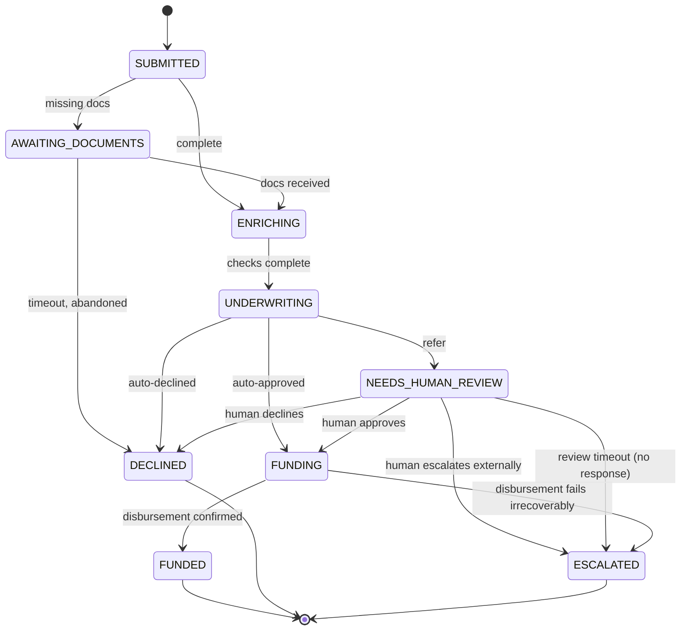

# TDD — Implementation Design

Companion to [02 — System Design](./02-system-design.md); this doc is the
code-level contract. Implementation follows in `/backend` and `/frontend`.

## 1. Stack

| Layer | Choice | Why |
|---|---|---|
| Workflow orchestration | Temporal Python SDK | Case study requirement |
| API | FastAPI | Async-native, pairs naturally with the Temporal Python SDK's async client |
| Workflow/activity language | Python 3.12 | One language across API + orchestration |
| Data store | Postgres | Operational state + audit trail |
| Object storage | Local disk (dev) / S3-compatible interface (prod-shaped) | Document blobs |
| Frontend | React + Vite, minimal component kit | "Clean, minimal UI" per the ask — no heavy framework needed for a 2-persona dashboard |
| Local orchestration | Temporal CLI dev server (`temporal server start-dev`) + Docker Compose for Postgres/API/worker/web | "Bonus if you can run it locally" |

## 2. Repo layout

```
backend/
├── workflows/
│   ├── loan_application_workflow.py
│   └── batch_ingestion_workflow.py
├── activities/
│   ├── validation.py
│   ├── checks.py                # credit / identity / fraud
│   ├── underwriting.py
│   ├── disbursement.py
│   ├── documents.py
│   └── audit.py
├── policies/
│   ├── base.py                   # LoanProductPolicy interface
│   ├── personal.py
│   ├── auto.py
│   └── debt_consolidation.py
├── adapters/                      # mocked third-party clients
│   ├── credit_bureau.py
│   ├── identity_provider.py
│   ├── fraud_provider.py
│   └── core_banking.py
├── api/
│   ├── main.py
│   ├── routes_applications.py     # includes review endpoints
│   └── routes_ingestion.py
├── db/
│   ├── models.py                  # SQLAlchemy models mirroring the 5-table entity model
│   └── migrations/
├── worker.py                      # one worker, one task queue: "loan-processing"
└── tests/
```

## 3. Workflow: `LoanApplicationWorkflow`

```python
@workflow.defn
class LoanApplicationWorkflow:
    def __init__(self) -> None:
        self.status: ApplicationStatus = ApplicationStatus.SUBMITTED
        self.documents_received: dict[str, bool] = {}
        self.review_decision: ReviewDecision | None = None
        self.sla_deadline: datetime | None = None

    @workflow.run
    async def run(self, application: ApplicationInput) -> ApplicationResult:
        self.sla_deadline = workflow.now() + timedelta(hours=48)
        policy = get_product_policy(application.product_type)

        # 1. Validate
        result = await workflow.execute_activity(
            validate_application, application, policy,
            task_queue="loan-processing",
            start_to_close_timeout=timedelta(seconds=30),
        )
        if result.missing_documents:
            self.status = ApplicationStatus.AWAITING_DOCUMENTS
            await workflow.wait_condition(
                lambda: all(self.documents_received.get(d) for d in result.missing_documents),
                timeout=self._remaining_sla(),
            )
            if not all(self.documents_received.get(d) for d in result.missing_documents):
                return await self._decline("documents_not_received")

        # 2. Enrich — parallel third-party checks, each with its own retry policy
        self.status = ApplicationStatus.ENRICHING
        credit, identity, fraud = await asyncio.gather(
            workflow.execute_activity(fetch_credit_report, application,
                task_queue="loan-processing", retry_policy=THIRD_PARTY_RETRY,
                start_to_close_timeout=timedelta(minutes=5)),
            workflow.execute_activity(verify_identity, application,
                task_queue="loan-processing", retry_policy=THIRD_PARTY_RETRY,
                start_to_close_timeout=timedelta(minutes=5)),
            workflow.execute_activity(run_fraud_check, application,
                task_queue="loan-processing", retry_policy=THIRD_PARTY_RETRY,
                start_to_close_timeout=timedelta(minutes=5)),
            return_exceptions=True,
        )

        # 3. Underwrite
        self.status = ApplicationStatus.UNDERWRITING
        decision = await workflow.execute_activity(
            evaluate_underwriting, application, policy, credit, identity, fraud,
            task_queue="loan-processing",
            start_to_close_timeout=timedelta(seconds=30),
        )

        if decision.outcome == "approve":
            return await self._fund(application)
        if decision.outcome == "decline":
            return await self._decline(decision.reason)

        # 4. Human review
        self.status = ApplicationStatus.NEEDS_HUMAN_REVIEW
        await workflow.execute_activity(create_review_task, application, decision.reason,
            task_queue="loan-processing", start_to_close_timeout=timedelta(seconds=30))
        await workflow.wait_condition(
            lambda: self.review_decision is not None,
            timeout=self._remaining_sla(),
        )
        if self.review_decision is None:
            return await self._escalate("review_timeout")
        if self.review_decision.outcome == "approve":
            return await self._fund(application)
        if self.review_decision.outcome == "decline":
            return await self._decline(self.review_decision.reason)
        return await self._escalate(self.review_decision.reason)

    @workflow.signal
    async def submit_document(self, doc: DocumentSubmission) -> None:
        self.documents_received[doc.doc_type] = True

    @workflow.signal
    async def submit_review_decision(self, decision: ReviewDecision) -> None:
        self.review_decision = decision

    @workflow.query
    def get_status(self) -> str:
        return self.status.value

    @workflow.query
    def get_sla_remaining(self) -> float:
        return self._remaining_sla().total_seconds()

    def _remaining_sla(self) -> timedelta:
        return max(self.sla_deadline - workflow.now(), timedelta(0))
```

(Full implementation in `backend/workflows/loan_application_workflow.py`; helper
methods `_fund` / `_decline` / `_escalate` handle disbursement and terminal-state
bookkeeping, trimmed here for readability.)

**Determinism note:** `workflow.now()` is used for every "current time" read
inside the workflow (never `datetime.now()`) — required for replay safety, and
it's how `sla_deadline` stays deterministic across replays.

### 3.1 State machine



`NEEDS_HUMAN_REVIEW` is **not** the terminal "escalated" state from the case
study — it's the workflow's internal wait-for-a-human step. `ESCALATED`
(terminal) means the case has been handed off to a manual/off-platform process
and the workflow completes.

## 4. Other workflows

**`BatchIngestionWorkflow`** — parses an aggregator file, validates/dedupes
records, and for each valid record calls an activity that uses the Temporal
client to start an independent `LoanApplicationWorkflow` (same deterministic-ID
dedup as the other two channels). It doesn't use child workflows — each
application needs to live independently for however long review takes, fully
decoupled from the batch job that introduced it. `BatchIngestionWorkflow`
finishes once fan-out is done and returns aggregate success/failure counts.

## 5. Task queue & resilience design

One task queue, `loan-processing`, handles everything — validation, all three
checks, underwriting, disbursement, and batch fan-out. Resilience comes from a
per-activity `RetryPolicy`, not queue-level isolation:

```python
THIRD_PARTY_RETRY = RetryPolicy(
    initial_interval=timedelta(seconds=2),
    backoff_coefficient=2.0,
    maximum_interval=timedelta(minutes=2),
    maximum_attempts=5,
    non_retryable_error_types=["InvalidApplicationDataError"],
)
```

This is enough to correctly handle "a provider is rate-limited, times out, or
has a brief outage" — the case study's actual ask — without needing dedicated
task queues per provider. See
[Trade-offs](./05-tradeoffs-and-future-work.md#simplifications-made-for-this-build-and-the-upgrade-path)
for when splitting queues would actually earn its complexity.

## 6. Data schemas (Postgres)

Mirrors the entity model in [System Design §2](./02-system-design.md#2-core-entities)
directly — `applications`, `documents`, `checks`, `review_tasks`, `audit_events`.
Full DDL in `backend/db/migrations/`. Key indexes: `applications(status,
sla_deadline)` for the dashboard's SLA-risk filter; `audit_events
(application_id, occurred_at)` for compliance lookups.

PII handling: SSN stored as a salted hash for matching + last-4 in cleartext for
display; document blobs live in object storage, not Postgres, with only a
storage reference persisted in the DB.

## 7. Testing strategy

- **Workflow unit tests** via Temporal's `WorkflowEnvironment` time-skipping test
  server — lets a 48-hour SLA wait or a multi-day human-review wait execute in
  milliseconds, with mocked activities standing in for the third-party adapters.
- **Activity tests** exercise the mocked adapters directly, including their
  simulated retry/failure behavior.
- **Policy tests** verify each `LoanProductPolicy` implementation in isolation.
- **Integration**: `docker-compose up` brings up a real (dev-mode) Temporal
  server, Postgres, the worker, and the API, so the full path — including actual
  signal delivery and replay — is exercised end-to-end locally.

## 8. Local run

```bash
cd ops
docker compose up          # Temporal dev server + Postgres + worker + API + web
```

Then submit a test application through any of the three channel entry points
(scripts in `ops/seed/`) and watch it move through the Temporal Web UI at
`localhost:8233` and the ops dashboard at `localhost:5173`.
