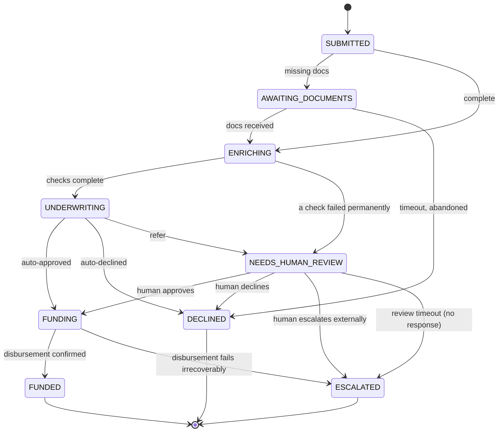

# TDD — Implementation Design

Companion to [02 — System Design](./02-system-design.md); this doc is the
code-level contract. Implementation follows in `/backend` and `/frontend`.

> **Revision note:** this version incorporates fixes from a cross-model review
> pass (two independent reviews, both converging on the same core issues). The
> corrections are called out inline rather than silently — worth knowing which
> parts were wrong in v1 and why, since it's likely to come up.

## 1. Stack

| Layer | Choice | Why |
|---|---|---|
| Workflow orchestration | Temporal Python SDK | Case study requirement |
| API | FastAPI | Async-native, pairs naturally with the Temporal Python SDK's async client |
| Workflow/activity language | Python 3.12 | One language across API + orchestration |
| Data store | Postgres | Operational state + audit trail |
| Object storage | Local disk (dev) / S3-compatible interface (prod-shaped) | Document blobs |
| Frontend | React + Vite, minimal component kit | "Clean, minimal UI" per the ask — no heavy framework needed for a 2-persona dashboard |
| Local orchestration | Temporal CLI dev server (`temporal server start-dev`) + Docker Compose for Postgres/API/worker/web | "Bonus if you can run it locally" |

## 2. Repo layout

```
backend/
├── workflows/
│   ├── loan_application_workflow.py
│   └── batch_ingestion_workflow.py
├── activities/
│   ├── validation.py
│   ├── checks.py                # credit / identity / fraud
│   ├── underwriting.py
│   ├── disbursement.py
│   ├── documents.py
│   └── audit.py
├── policies/
│   ├── base.py                   # LoanProductPolicy interface
│   ├── personal.py
│   ├── auto.py
│   └── debt_consolidation.py
├── adapters/                      # mocked third-party clients
│   ├── credit_bureau.py
│   ├── identity_provider.py
│   ├── fraud_provider.py
│   └── core_banking.py
├── api/
│   ├── main.py
│   ├── routes_applications.py     # includes review + ingestion endpoints
├── db/
│   ├── models.py                  # SQLAlchemy models mirroring the 5-table entity model
│   └── migrations/
├── worker.py                      # one worker, one task queue: "loan-processing"
└── tests/
```

## 3. Workflow: `LoanApplicationWorkflow`

```python
@workflow.defn
class LoanApplicationWorkflow:
    def __init__(self) -> None:
        self.status: ApplicationStatus = ApplicationStatus.SUBMITTED
        self.documents_received: dict[str, bool] = {}
        self.review_decision: ReviewDecision | None = None
        self.sla_deadline: datetime | None = None

    @workflow.run
    async def run(self, application: ApplicationInput) -> ApplicationResult:
        self.sla_deadline = workflow.now() + timedelta(hours=48)

        # 1. Validate. Only application.product_type (a string) crosses the
        # activity boundary — a LoanProductPolicy instance can't be serialized
        # by the default data converter, so the activity resolves the policy
        # itself. (v1 resolved the policy in the workflow and passed the
        # object — contradicted System Design §6, and wouldn't have worked.)
        result = await workflow.execute_activity(
            validate_application,
            args=[application, application.product_type],
            start_to_close_timeout=timedelta(seconds=30),
            retry_policy=RetryPolicy(maximum_attempts=3),
        )
        if result.missing_documents:
            self.status = ApplicationStatus.AWAITING_DOCUMENTS
            try:
                await workflow.wait_condition(
                    lambda: all(self.documents_received.get(d) for d in result.missing_documents),
                    timeout=self._remaining_sla(),
                )
            except asyncio.TimeoutError:
                # wait_condition raises on timeout, it does not return False.
                # (v1 checked the condition again after the call — dead code;
                # an uncaught TimeoutError fails the workflow task and retries
                # forever instead of declining. This except is the only way
                # AWAITING_DOCUMENTS -> DECLINED actually fires.)
                return await self._decline(application, "documents_not_received")

        # 2. Enrich — parallel third-party checks, each with its own retry
        # policy. return_exceptions=True keeps one permanently-failed check
        # from cancelling the others in the gather.
        self.status = ApplicationStatus.ENRICHING
        credit, identity, fraud = await asyncio.gather(
            workflow.execute_activity(fetch_credit_report, application,
                retry_policy=THIRD_PARTY_RETRY,
                start_to_close_timeout=timedelta(minutes=5)),
            workflow.execute_activity(verify_identity, application,
                retry_policy=THIRD_PARTY_RETRY,
                start_to_close_timeout=timedelta(minutes=5)),
            workflow.execute_activity(run_fraud_check, application,
                retry_policy=THIRD_PARTY_RETRY,
                start_to_close_timeout=timedelta(minutes=5)),
            return_exceptions=True,
        )
        # A failed check is a data gap, never an underwriting input. (v1
        # passed credit/identity/fraud straight into evaluate_underwriting
        # with no check — an exhausted-retries check would either fail to
        # serialize as an activity arg or silently reach a risk decision on
        # a degraded input.) Inspect explicitly, route to review instead.
        if any(isinstance(c, BaseException) for c in (credit, identity, fraud)):
            return await self._send_to_review(application, "check_unavailable")

        # 3. Underwrite
        self.status = ApplicationStatus.UNDERWRITING
        decision = await workflow.execute_activity(
            evaluate_underwriting,
            args=[application, application.product_type, credit, identity, fraud],
            start_to_close_timeout=timedelta(seconds=30),
            retry_policy=RetryPolicy(
                maximum_attempts=3,
                non_retryable_error_types=["InvalidApplicationDataError"],
            ),
        )

        if decision.outcome == "approve":
            return await self._fund(application)
        if decision.outcome == "decline":
            return await self._decline(application, decision.reason)

        # 4. Human review
        return await self._send_to_review(application, decision.reason)

    async def _send_to_review(self, application: ApplicationInput, reason: str) -> ApplicationResult:
        self.status = ApplicationStatus.NEEDS_HUMAN_REVIEW
        await workflow.execute_activity(
            create_review_task, args=[application, reason],
            start_to_close_timeout=timedelta(seconds=30),
        )
        try:
            await workflow.wait_condition(
                lambda: self.review_decision is not None,
                timeout=self._remaining_sla(),
            )
        except asyncio.TimeoutError:
            # Same fix as above — this except is what makes the review-timeout
            # edge to ESCALATED reachable at all.
            return await self._escalate(application, "review_timeout")
        if self.review_decision.outcome == "approve":
            return await self._fund(application)
        if self.review_decision.outcome == "decline":
            return await self._decline(application, self.review_decision.reason)
        return await self._escalate(application, self.review_decision.reason)

    async def _fund(self, application: ApplicationInput) -> ApplicationResult:
        self.status = ApplicationStatus.FUNDING
        # Minted here, once, with workflow.uuid4() — never uuid.uuid4() (not
        # replay-deterministic) and never inside the activity (every activity
        # retry would mint a fresh key, defeating the idempotency guarantee
        # this ID exists for).
        disbursement_id = str(workflow.uuid4())
        result = await workflow.execute_activity(
            disburse_funds, args=[application, disbursement_id],
            start_to_close_timeout=timedelta(seconds=30),
            retry_policy=RetryPolicy(maximum_attempts=5),
        )
        if not result.success:
            return await self._escalate(application, "disbursement_failed")
        self.status = ApplicationStatus.FUNDED
        return ApplicationResult(status=self.status)

    async def _decline(self, application: ApplicationInput, reason: str) -> ApplicationResult:
        self.status = ApplicationStatus.DECLINED
        await workflow.execute_activity(record_audit_event, args=[application, "declined", reason],
            start_to_close_timeout=timedelta(seconds=30))
        return ApplicationResult(status=self.status, reason=reason)

    async def _escalate(self, application: ApplicationInput, reason: str) -> ApplicationResult:
        self.status = ApplicationStatus.ESCALATED
        await workflow.execute_activity(record_audit_event, args=[application, "escalated", reason],
            start_to_close_timeout=timedelta(seconds=30))
        return ApplicationResult(status=self.status, reason=reason)

    @workflow.signal
    async def submit_document(self, doc: DocumentSubmission) -> None:
        self.documents_received[doc.doc_type] = True

    @workflow.signal
    async def submit_review_decision(self, decision: ReviewDecision) -> None:
        self.review_decision = decision

    @workflow.query
    def get_status(self) -> str:
        return self.status.value

    def _remaining_sla(self) -> timedelta:
        return max(self.sla_deadline - workflow.now(), timedelta(0))
```

**On the removed `get_sla_remaining()` query** (present in v1): a Query answers
against workflow state as of the last *completed* workflow task. A workflow
parked in `wait_condition` for 30 hours produces no new tasks, so
`workflow.now()` read inside a query during that stretch returns the timestamp
of that last task — not wall-clock now. The query wouldn't error, it would just
silently return a frozen number. `get_status()` doesn't have this problem
because the status value genuinely doesn't change while parked, so a frozen
read is still a correct read. A live countdown needs wall-clock time, which a
query can't safely give you here — the dashboard computes it directly from the
`sla_deadline` column already written to Postgres at submission, which is exact
at any wall-clock moment without asking the workflow at all.

**Determinism note:** `workflow.now()` is used for every "current time" read
inside the workflow (never `datetime.now()`), and `workflow.uuid4()` for the
disbursement ID (never `uuid.uuid4()`) — both required for replay safety.

**Sandbox imports:** the workflow module can't import SQLAlchemy models or
adapter clients at module level — Temporal's sandbox restricts non-deterministic
imports inside workflow-defining modules. Shared dataclasses (like
`ApplicationInput`) that need to cross both boundaries go through
`with workflow.unsafe.imports_passed_through():`; everything else (DB clients,
adapter HTTP clients) stays behind the activity boundary entirely.

**Versioning:** this workflow is explicitly built around waits that can last
days. Any change to the activity sequence while applications are parked in
`NEEDS_HUMAN_REVIEW` risks a non-determinism error on replay for in-flight
executions. `workflow.patched()` (or Worker Build ID versioning for larger
changes) is required once this ships past the first deploy — flagged here so
it's not a surprise mid-build, full treatment is future work.

### 3.1 State machine



Added one edge vs. v1: `ENRICHING → NEEDS_HUMAN_REVIEW` for a permanently-failed
check, matching the `return_exceptions` handling fix above — v1's diagram didn't
have a path for this at all, which is exactly the gap the review caught.

`NEEDS_HUMAN_REVIEW` is **not** the terminal "escalated" state from the case
study — it's the workflow's internal wait-for-a-human step. `ESCALATED`
(terminal) means the case has been handed off to a manual/off-platform process
and the workflow completes.

## 4. Starting a workflow (ingestion adapters)

All three channel adapters call the same client method, and the ID reuse policy
is not the default:

```python
try:
    await client.start_workflow(
        LoanApplicationWorkflow.run,
        application,
        id=f"loan-app-{channel}-{external_ref}",
        task_queue="loan-processing",
        id_reuse_policy=WorkflowIDReusePolicy.REJECT_DUPLICATE,
    )
except WorkflowAlreadyStartedError:
    # Same external_ref seen again. Could be a legitimate resend of a still-
    # running application (safe no-op) or a redelivery after the original
    # already reached a terminal state (needs investigation, not a silent
    # duplicate) — the adapter checks Postgres status and responds accordingly.
    ...
```

**On the dedup claim in v1:** "Temporal rejects a second `start_workflow` for an
ID that's already running" was true but incomplete — the default
`WorkflowIDReusePolicy` allows starting a new execution once the previous one
has *closed*. Without `REJECT_DUPLICATE` set explicitly, a batch file
redelivered after the original application already funded would create a
genuine duplicate, not get rejected. This is corrected in
[System Design §4.1](./02-system-design.md#41-ingestion--three-channels-converge-to-one-workflow).

## 5. Other workflows

**`BatchIngestionWorkflow`** — parses an aggregator file, validates/dedupes
records, and for each valid record calls an activity that uses the Temporal
client to start an independent `LoanApplicationWorkflow` (§4 above) rather than
a child workflow. The reason isn't lifecycle decoupling — `ParentClosePolicy.
ABANDON` would give a child workflow that too. It's two more concrete things:
starting thousands of children would add thousands of events to the *parent's*
history for no benefit, and a duplicate/already-started record is just an
ordinary caught exception on an independent client call, rather than something
that needs child-workflow-specific handling.

## 6. Task queue & resilience design

One task queue, `loan-processing`, handles everything — validation, all three
checks, underwriting, disbursement, and batch fan-out, set once on the `Worker`.
Activities inherit the workflow's task queue by default, so it isn't repeated on
every `execute_activity` call (v1 did this — harmless, but noise, and it
hardcodes the queue name into workflow code, which cuts against the "activity
boundary is already shaped to split queues later" argument in the system
design — if you later split providers onto dedicated queues, that's a one-line
change per activity registration, not a find-and-replace through workflow logic).

Resilience comes from a per-activity `RetryPolicy`, not queue-level isolation:

```python
THIRD_PARTY_RETRY = RetryPolicy(
    initial_interval=timedelta(seconds=2),
    backoff_coefficient=2.0,
    maximum_interval=timedelta(minutes=2),
    maximum_attempts=5,
    non_retryable_error_types=["InvalidApplicationDataError"],
)
```

`non_retryable_error_types` matches against the failure's type name as a
string — fragile against renames. Prefer raising
`ApplicationError(..., non_retryable=True)` from the activity over relying on
the class-name match where it matters.

This is enough to correctly handle "a provider is rate-limited, times out, or
has a brief outage" — the case study's actual ask — without needing dedicated
task queues per provider. See
[Trade-offs](./05-tradeoffs-and-future-work.md#simplifications-made-for-this-build-and-the-upgrade-path)
for when splitting queues would actually earn its complexity.

## 7. Data schemas (Postgres)

Mirrors the entity model in [System Design §2](./02-system-design.md#2-core-entities)
directly — `applications`, `documents`, `checks`, `review_tasks`, `audit_events`.
Full DDL in `backend/db/migrations/`. Key indexes: `applications(status,
sla_deadline)` for the dashboard's SLA-risk filter (computed directly from the
stored deadline — see the query note in §3); `audit_events(application_id,
occurred_at)` for compliance lookups.

PII handling: SSN stored as a salted hash for matching + last-4 in cleartext for
display; document blobs live in object storage, not Postgres, with only a
storage reference persisted in the DB.

**Open question flagged, not solved, here:** `audit_events` is written by a
separate activity call alongside the state transition, not in the same
transaction as it. See
[Trade-offs](./05-tradeoffs-and-future-work.md#simplifications-made-for-this-build-and-the-upgrade-path)
— this is the one gap in the design worth having a direct answer for rather
than a code fix, since it touches the audit requirement itself, not an
implementation detail.

## 8. Testing strategy

- **Workflow unit tests** via `WorkflowEnvironment.start_time_skipping()` — the
  specific method for the auto-time-skip test server (`start_local()` runs a
  real dev server and does *not* skip time — easy mix-up). This lets a 48-hour
  SLA wait or a multi-day review wait execute in the test in milliseconds, with
  mocked activities standing in for the third-party adapters. Time-skipping
  pauses while an activity is actually executing, so the mocked activities need
  to return promptly, or the "runs in milliseconds" property breaks.
- **Activity tests** exercise the mocked adapters directly, including their
  simulated retry/failure behavior.
- **Policy tests** verify each `LoanProductPolicy` implementation in isolation.
- **Integration**: `docker-compose up` brings up a real (dev-mode) Temporal
  server, Postgres, the worker, and the API, so the full path — including actual
  signal delivery and replay — is exercised end-to-end locally.
- Specifically worth a test given what the review caught: **a workflow test
  that actually lets the document/review wait time out**, asserting the
  terminal state lands on `DECLINED`/`ESCALATED` rather than the workflow task
  failing. This is exactly the test whose absence let the `wait_condition` bug
  through.

## 9. Local run

```bash
cd ops
docker compose up          # Temporal dev server + Postgres + worker + API + web
```

Then submit a test application through any of the three channel entry points
(scripts in `ops/seed/`) and watch it move through the Temporal Web UI at
`localhost:8233` and the ops dashboard at `localhost:5173`.
